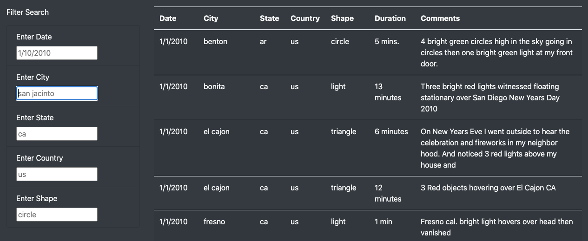
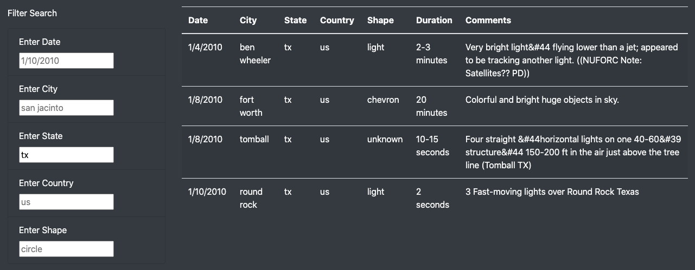
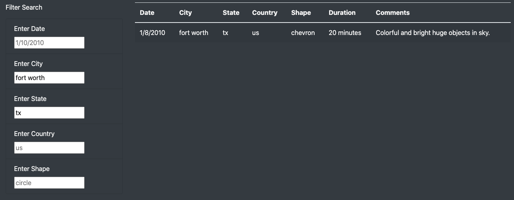

# UFOs

## Overview of Project

### Purpose

Our objective is to organize a JavaScript array of data about UFO sightings into a dynamic table that can be filtered by the following criteria: date, city, state, country, and shape.

### Resources
- Data: [data.js](data.js)
- Software: JavaScript, Visual Studio Code 1.52.1, Google Chrome 87.0, HTML5, CSS3

## Project Results

### Walk-through

The process to conduct a search through the UFO data would be as follows:

1. Arrive on webpage and locate the 'Filter Search' section on the left-hand side towards the bottom of the page. 

2. Select a category you want to filter by and input your criteria in the same format as displayed by the palceholder. Clicking anywhere outside of the current search bar, hitting `Tab`, or hitting `Enter`/`Return` should all update the table to reflect your filtered search.  
In our example we filtered by `tx` in the `State` category.
 

3. Additional filters can be added in the same manner as the original filter. Again, update your table by clicking anywhere outside of the current search bar, hitting `Tab`, or hitting `Enter`/`Return`.  
In our example we added the filter of `fort worth` in the `City` category.

4. Reset the table by deleting all search criteria or by clicking the `UFO Sightings` in the top left corner of the webpage: 

## Summary

### Drawback

I think a major drawback to the current design of the webpage is that there are now 5 searchable criteria and they all require user inputted text. This greatly increases the chances of not finding any results because of how literal the interpreter reads the input.

### Next Steps

1. The first recommendation is to address the potential for human error. Placeholders are a good initial step to show the user how to format their search, but I believe the addition of dropdown boxes for the city, state, country, and shape criteria would greatly reduce human input error.
2. Another suggestion would be to adjust how to filter by date. We could add an interactive calendar to be able to select a start date and end date. This would not only allow us to cut back on potential typo errors in the input, but also allow the user to search by weeks, months, etc. (the default end date could be set to equal the start date under the assumption the search was intended to only be one day).
